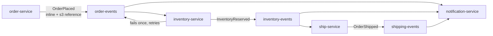

# multi-step workflow

four services chained across three event types. order-service publishes `OrderPlaced` (one inline, one oversized → s3 reference). inventory-service consumes both, deliberately fails for the oversized one (retries), then emits `InventoryReserved`. ship-service picks up `InventoryReserved` and emits `OrderShipped`. notification-service handles both `OrderPlaced` and `OrderShipped`.



## quick start

```bash
npm install && npm run demo
```

creates all resources (3 sns topics, 3 sqs queues, 5 subscriptions, shared s3 bucket), runs all 4 services in sequence, cleans up.

requires [localstack](https://www.localstack.cloud/)

## what this demonstrates

- **event chaining** — a handler emits the next event in the flow, fanning out to multiple consumers
- **oversized payloads** — same `OrderPlaced` class, 3000 items exceeds 256KB sns limit, framework stores in s3 transparently
- **error isolation** — a failing handler doesn't crash the service; the message stays on the queue, retries after the visibility timeout
- **multi-consumer fan-out** — notification-service subscribes to both `order-events` and `shipping-events`, handles two event types
- **shared s3 bucket** — `eventing-reference-bucket` shared by all services — publisher stores, any consumer resolves
