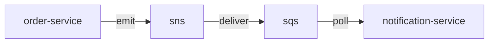

# single event

order-service publishes `OrderPlaced` events to sns. notification-service polls sqs and handles them.



## quick start

```bash
npm install && npm run demo
```

creates all resources (sns topic, sqs queue, s3 bucket, subscription), emits an event, polls and handles it, cleans up.

requires [localstack](https://www.localstack.cloud/)

## what this demonstrates

- `OrderEvent` base class — injects `app` and `category` once, every order event gets them for free
- shared types in `common/` — publisher owns the `DomainEvent` subclass, consumer imports only the payload type
- `EventPublisher.emit()` — fire events from anywhere in-process without coupling to `Application`
- both `on()` patterns — typed map (`Application<AppEvents>`) and explicit generic (`on<OrderPlacedPayload>()`)
- `app.start()`/`app.stop()` — lifecycle with scheduler for continuous polling
